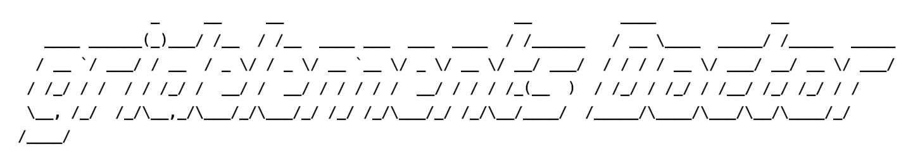

Gridelements doctor
===================



This is a repair tool to check and fix all Gridelements items in a TYPO3 installation.

Scenario
--------

A TYPO3 upgrade from version 6.2 to 7.6 LTS or 8.7 LTS will also require a Gridelements upgrade from version 3.4.0 (max.
version for TYPO3 6.2) to 7.0.0 (min. version for TYPO3 7.6 LTS) or 8.0.0 (min. version for TYPO3 8.7 LTS). After a
successful migration, the Gridelements infrastructure in the frontend will have no effect until you change or save the
content elements in the backend. 


Problem
-------

The new update hook of Gridelements should be fix invalid maintenance in the backend. But that makes sense only for new
TYPO3 installations and a fresh or blank content archive. During an upgrade with a large content archive over several
years, a comprehensive migration should have take place before! If you do not do that, you have messed up very quickly,
often inconspicuous, many content elements that are difficult or impossible to restore.

However, such a migration (or misbehavior-fix-tool) will not be provided by Gridelements. 

So we want to introduce that missing feature with this doctor tool.

[Thanks to Jo Hasenau](https://gitlab.com/cybercraft.jh)


Solution
--------

The doctor checks the principles of the new localization of TYPO3 (see `l18n_parent`) for Gridelements behavior:

- an unconnected container can only have unconnected children (free mode)
- a connected container (localized) can only have connected children (connected mode)

Following scenarios will be also fixed with this doctor:

**All children of a connected container are not connected**

[Scenario 1](Documentation/Scenario1.png)

The solution: The container will be stored unconnected.

**All children of an unconnected container are connected**

[Scenario 2](Documentation/Scenario1.png)

The solution: The container will be stored connected (with the help of his children).

**The children of a container are mixed (connected or free mode)**

[Scenario 3](Documentation/Scenario1.png)

The solution: The container will be stored unconnected and all children will be also stored unconnected.

Following rules are checked and fixed:
- [Scenario 4](Documentation/Scenario1.png) Available container of default language should not have a localized parent (`l18n_parent`).
- [Scenario 5](Documentation/Scenario2.png) Available children of default language should not have a localized parent (`l18n_parent`).
- [Scenario 6](Documentation/Scenario3.png) Available connected children must have the right column (`tx_gridelements_columns`).
- [Scenario 7](Documentation/Scenario4.png) Available connected children should not connected to the right containers (`tx_gridelements_container`).
- [Scenario 8](Documentation/Scenario5.png) Available connected children should not connected to multiple containers (`tx_gridelements_container`).
- [Scenario 9](Documentation/Scenario6.png) Available connected children should not have less origin children (`tx_gridelements_container`).
- [Scenario 10](Documentation/Scenario7.png) The amount of available connected children must be matched in the belonging container (`tx_gridelements_children`).

Following rules are also checked, but are not fixable:
- [Scenario 11](Documentation/Scenario8.png) Available children of a container should not have a different language (`sys_language_uid`).

The reference index (`sys_refindex`) will be rebuild - because it is a faster updater than the official update task.

**Important notice**

Beware of the different behavior of the new localization modes of TYPO3 from Version 7.6 LTS and the restriction rules
of Gridelements from Version 7. This may require a new editorial training that should follow this principle more and
describes how content needs to be localized. Some tricks (or misbehavior) that you could still apply as editor before
will no longer work.


Installation
------------

```
    $ git clone https://..../ gridoc
    $ composer install --no-dev
```

Preparation
-----------

Copy the `.env.template` file to `.env` and adjust the credentials for your database connection.


Application
-----------

```
    $ ./doctor.php help
```

Wishlist
========

1 - TYPO3 console support
-------------------------

Implement "gridelements doctor" to an TYPO3 console task and provide it as a TYPO3 extension:


**Installation**

```
    $ composer require hmmh/gridelements-doctor --no-dev
```


**Application**

```
    $ typo3cms gridelements:doctor
    $ typo3cms gridelements:doctor --heal
```

1 - TYPO3 backend module
-------------------------

Implement "gridelements Doctor" to TYPO3 backend as module.
